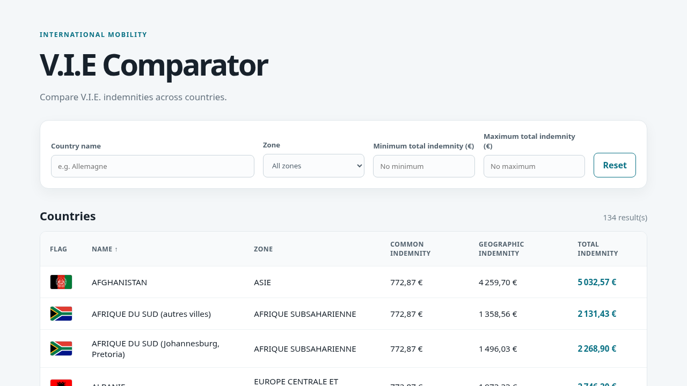

# V.I.E Comparator

[](https://github.com/AbdourahmaneGadio/v.i.e_comparator/actions/workflows/ci-cd.yml)
[](https://github.com/AbdourahmaneGadio/v.i.e_comparator/commits/main)
[](https://github.com/AbdourahmaneGadio/v.i.e_comparator)

A React and TypeScript application for comparing V.I.E. indemnities across countries.



## Features

- Search countries by name
- Filter by minimum and maximum total indemnity
- Filter by geographic zone
- Display country flags
- Switch between English and French
- Sort the table by clicking a column header
- Browse results with pagination (10 countries per page)

## Repository structure

```text
.
├── .github/
│   ├── dependabot.yml
│   └── workflows/ci-cd.yml
├── .husky/pre-commit
├── docs/screenshot.png
├── e2e/app.spec.ts
├── public/flags/
├── src/
│   ├── components/
│   │   ├── CountryTable.tsx
│   │   ├── Filters.tsx
│   │   └── Pagination.tsx
│   ├── data/countries_v.i.e_data.tsx
│   ├── i18n.ts
│   ├── App.test.tsx
│   ├── App.tsx
│   ├── main.tsx
│   └── types.ts
├── Dockerfile
├── docker-compose.yml
├── nginx.conf
└── package.json
```

`App.tsx` coordinates application state, while the components handle filters, table rendering, sorting, and pagination independently.

## Getting started

Requirements:

- Node.js 20 or newer
- npm

Install dependencies:

```bash
npm install
```

Start the development server:

```bash
npm run dev
```

The application is then available at the local URL shown by Vite.

## Available scripts

```bash
npm run build  # Type-check and create a production build
npm run lint   # Run ESLint
npm run preview # Preview the production build
npm test        # Run the test suite once
npm run test:watch # Run tests in watch mode
npm run test:e2e # Run browser-based end-to-end tests
npm run test:e2e:ui # Open Playwright’s interactive test UI
npm run precommit # Run the checks enforced before commits
```

## Data

Country indemnity data is stored in [`src/data/countries_v.i.e_data.tsx`](src/data/countries_v.i.e_data.tsx). The displayed total indemnity corresponds to the dataset’s `monthlyPay` value.

The application uses the indemnity data for 2025. The source is the official [V.I.E./V.I.A. Business France website](https://mon-vie-via.businessfrance.fr).

Country flags are provided by [`svg-country-flags`](https://github.com/hjnilsson/country-flags) and bundled in `public/flags`.

## Testing

Tests use Vitest with React Testing Library and cover the default pagination, name and zone filters, column sorting, and page navigation.

End-to-end tests use Playwright and run against a local Vite development server. Install the browser once with:

```bash
npx playwright install chromium
```

Husky runs the lint and unit-test checks automatically before each commit. The same `npm run precommit` command is executed by the CI pipeline.

## Docker

Build and start the production container locally:

```bash
docker compose up --build
```

The application is then available at [http://localhost:8080](http://localhost:8080). Stop it with:

```bash
docker compose down
```

The GitHub Actions workflow runs tests, linting, and the production build for pushes and pull requests targeting `main`. A successful push to `main` also publishes `latest` and commit-specific tags to GitHub Container Registry. The repository’s Actions workflow must have permission to write packages for the publish step.

## Automation

- GitHub Actions runs the pre-commit checks, production build, and Docker pipeline.
- Dependabot checks npm, GitHub Actions, and Docker dependencies weekly.
- Docker images are published to GitHub Container Registry after successful pushes to `main`.

## AI assistance

AI was partially used during this project to assist with implementation, code organization, styling, and documentation. The resulting code and behavior were reviewed and tested locally.
